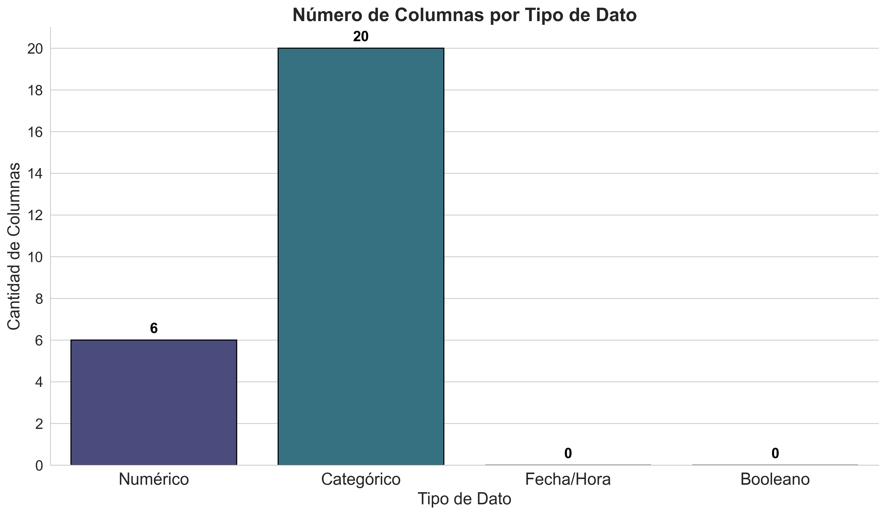
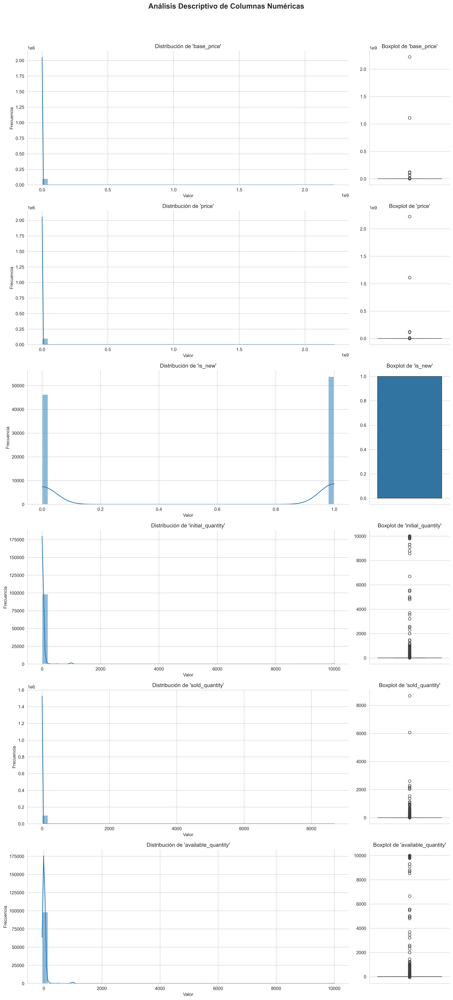
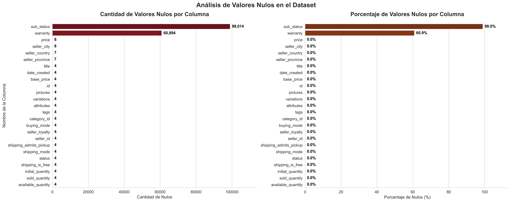
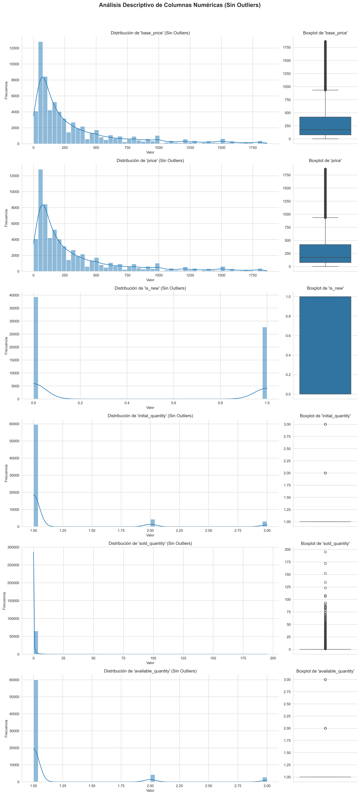
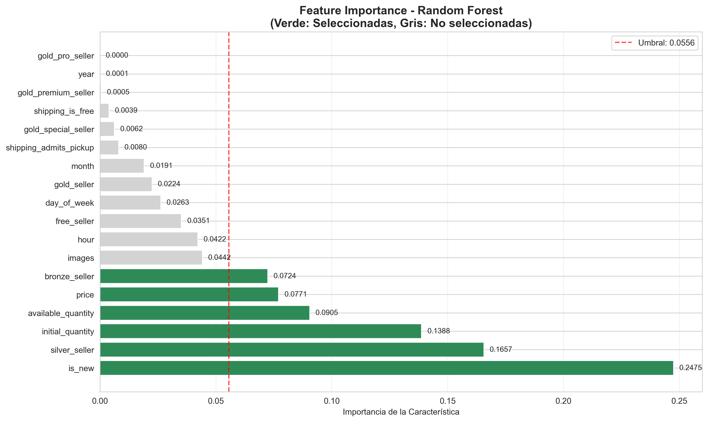

# Análisis Predictivo y Pipeline de Producción - Desafío Técnico ACQ 2025

## 1. Descripción del Proyecto
Este repositorio contiene la solución completa para el Desafío Técnico ACQ 2025. El proyecto se centra en el análisis exhaustivo de un dataset de productos de MercadoLibre, con el objetivo de desarrollar modelos de machine learning que generen valor para el negocio. Se abarca desde el análisis exploratorio de datos (EDA) y la ingeniería de características hasta la implementación y evaluación de múltiples algoritmos predictivos, culminando en el diseño de un pipeline de producción escalable.

## 2. Objetivos Principales

Los objetivos clave de este proyecto son:

- **Análisis Exploratorio de Datos (EDA):** Realizar un análisis completo del dataset para comprender la distribución, relaciones y características de los datos.
- **Ingeniería de Características:** Crear y transformar variables para maximizar el rendimiento de los modelos predictivos.
- **Modelado Predictivo:** Implementar, entrenar y evaluar diversos algoritmas de Machine Learning para resolver un problema de negocio específico (ej. clasificación de productos, predicción de ventas, etc.).
- **Generación de Insights:** Extraer conclusiones y hallazgos accionables a partir de los datos y los resultados de los modelos, con aplicabilidad en áreas como Marketing y Estrategia de Negocio.
- **Pipeline de Producción:** Diseñar un flujo de trabajo robusto, escalable y mantenible para la puesta en producción de los modelos.

## 3. Metodología

El proyecto sigue una metodología estructurada en las siguientes fases:

1.  **Configuración del Entorno:** Creación de un entorno virtual y gestión de dependencias.
2.  **Análisis Exploratorio (EDA):** Inspección inicial, limpieza de datos, análisis univariado y bivariado, y visualización para identificar patrones.
3.  **Preprocesamiento e Ingeniería de Características:** Tratamiento de valores nulos, codificación de variables categóricas y creación de nuevas características relevantes.
4.  **Modelado y Evaluación:** Entrenamiento de algoritmos (ej. Regresión Logística, Random Forest, Gradient Boosting) y evaluación de su rendimiento mediante métricas apropiadas.
5.  **Optimización:** Ajuste de hiperparámetros para mejorar la precisión del modelo seleccionado.
6.  **Interpretación y Conclusiones:** Análisis de los resultados para generar insights de negocio.

## 4. Análisis exploratorio de datos (EDA)
- Total de registros: 100000
- Total de columnas: 26
- Tamaño del archivo: 217.22 MB

### 📈 Resumen estadístico

#### Variables Numéricas

| Estadística | base_price | price | is_new | initial_quantity | sold_quantity | available_quantity |
|:---| :--- | :--- | :--- | :--- | :--- | :--- |
| **Registros** | 99996.0 | 99992.0 | 100000.0 | 99996.0 | 99996.0 | 99996.0 |
| **Media** | 55067.93 | 52528.46 | 0.54 | 35.09 | 2.4 | 34.84 |
| **Mediana** | 250.0 | 250.0 | 1.0 | 1.0 | 0.0 | 1.0 |
| **Desviación Estándar** | 8632656.34 | 8623472.1 | 0.5 | 421.08 | 42.69 | 420.82 |
| **Mínimo** | 0.84 | 0.84 | 0.0 | 0.0 | 0.0 | -58.42 |
| **1%** | 17.0 | 17.0 | 0.0 | 1.0 | 0.0 | 1.0 |
| **5%** | 35.0 | 35.0 | 0.0 | 1.0 | 0.0 | 1.0 |
| **10%** | 49.99 | 49.99 | 0.0 | 1.0 | 0.0 | 1.0 |
| **25%** | 90.0 | 90.0 | 0.0 | 1.0 | 0.0 | 1.0 |
| **75%** | 800.0 | 800.0 | 1.0 | 2.0 | 0.0 | 2.0 |
| **90%** | 3100.0 | 3100.0 | 1.0 | 10.0 | 2.0 | 10.0 |
| **95%** | 7500.0 | 7500.0 | 1.0 | 45.0 | 5.0 | 43.0 |
| **99%** | 130000.0 | 130000.0 | 1.0 | 990.0 | 41.0 | 987.05 |
| **Máximo** | 2222222222.0 | 2222222222.0 | 1.0 | 9999.0 | 8676.0 | 9999.0 |

### ⚠️ Calidad de Datos

#### Valores Faltantes

- **Columnas con valores nulos**: 25 (96.2%)
- **Total de valores nulos**: 160,014
- **Porcentaje general de nulos**: 6.15%

### 🔍 Top 5 Columnas con Más Nulos

1. **sub_status**: 99,014.0 nulos (99.0%)
2. **warranty**: 60,894.0 nulos (60.9%)
3. **price**: 8.0 nulos (0.0%)
4. **seller_city**: 8.0 nulos (0.0%)
5. **seller_country**: 7.0 nulos (0.0%)

## 5. Feature Engineeering

### Tratamiento de nulos: 

⚙️ Configuración
- **Umbral para eliminar columna**: 50%
- **Estrategia**: Eliminar columna si nulos ≥ 50%, sino eliminar filas con nulos

📊 Resultados

| Métrica | Antes | Después | Cambio |
|---------|-------|---------|---------|
| **Filas** | 100,000 | 99,988 | -12 |
| **Columnas** | 26 | 24 | -2 |
| **Valores nulos** | 160,014 | 0 | -160,014 |

✅ Resultado: Dataset completamente limpio

### Tratamiento de Outliers

⚙️ Configuración
- **Método**: IQR (Rango Intercuartílico)
- **Multiplicador IQR**: 1.5
- **Criterio**: Una fila se elimina si tiene outliers por IQR en cualquier columna numérica

📊 Resumen General

| Métrica | Valor |
|---------|-------|
| **Filas originales** | 99,988 |
| **Filas finales** | 67,023 |
| **Filas eliminadas** | 32,965 |
| **Porcentaje eliminado** | 33.0% |
| **Columnas numéricas** | 6 |
| **Columnas con outliers** | 4 |
| **Total outliers detectados** | 70,897 |

📈 Análisis Detallado por Columna

| Columna | Outliers | Porcentaje | Rango de Valores | Rango Outliers | Estado |
|---------|----------|------------|------------------|----------------|--------|
| `base_price` | 14,633 | 14.6% | 0.84 - 2222222222.00 | 1869.00 - 2222222222.00 | 🚨 Con outliers |
| `price` | 14,634 | 14.6% | 0.84 - 2222222222.00 | 1869.00 - 2222222222.00 | 🚨 Con outliers |
| `is_new` | 0 | 0.0% | 0.00 - 1.00 | - | ✅ Limpio |
| `initial_quantity` | 21,219 | 21.2% | 1.00 - 9999.00 | 4.00 - 9999.00 | 🚨 Con outliers |
| `sold_quantity` | - | - | 0.00 - 8676.00 | - | ⚠️ Sin variación |
| `available_quantity` | 20,411 | 20.4% | 1.00 - 9999.00 | 4.00 - 9999.00 | 🚨 Con outliers |

🚨 **Impacto Alto**: Se eliminó una cantidad significativa de datos.

### Distribución de los datos sin outlliers:

### Creación de variables

Se implementó un proceso de ingeniería de características para enriquecer el dataset con variables derivadas que capturen patrones temporales y características adicionales del producto:

- **new_date:** Transformación de la columna `date_created` a tipo datetime.
- **day_of_week:** Extracción del día de la semana de la columna `new_date`.
- **month:** Extracción del mes de la columna `new_date`.
- **year:** Extracción del año de la columna `new_date`.
- **hour:** Extracción de la hora de la columna `new_date`.
- **images:** Cantidad de imágenes en la columna `pictures`.
- **target:** Variable objetivo para predecir si tendrá venta o no la publicación

        

### Selección de variables

Para el proceso de selección de características se utilizó el método de Random Forest Feature Importance, que evalúa la contribución de cada variable en la predicción del modelo mediante la medición de la reducción de impureza que aporta cada característica durante la construcción de los árboles de decisión.

- Importancia promedio: 0.0556
- Desviación estándar: 0.0660
- Umbral de selección: 0.0556
- Porcentaje seleccionado: 33.3%

    | Característica | Importancia | Estado |
    |----------------|-------------|--------|
  |is_new                    | 0.2475 | ✅ SELECCIONADA |
  |silver_seller             | 0.1657 | ✅ SELECCIONADA |
  |initial_quantity          | 0.1388 | ✅ SELECCIONADA |
  |available_quantity        | 0.0905 | ✅ SELECCIONADA |
  |price                     | 0.0771 | ✅ SELECCIONADA |
  |bronze_seller             | 0.0724 | ✅ SELECCIONADA |

   

Estas 6 variables capturan los elementos más importantes: calidad del producto, confianza en el vendedor y gestión de inventario, representando juntas casi el 80% de la importancia total del modelo, lo que permite crear un modelo eficiente y enfocado en los factores que realmente predicen el comportamiento de ventas.

## 6. Modelo predictivo

Analizando los resultados de los modelos predictivos, se pueden observar varios puntos importantes:
- **Rendimiento General**
  
  Random Forest es el modelo con mejor desempeño con un Mean Score de 0.6798, seguido muy de cerca por Support Vector Machine (0.7264). La diferencia entre los modelos es relativamente pequeña, sugiriendo que todos tienen capacidades predictivas similares para este dataset.

- **Consistencia de los Modelos**

    Los valores de desviación estándar son bastante bajos (entre 0.0063-0.0085), lo que indica que todos los modelos son consistentes y estables en sus predicciones a través de diferentes validaciones cruzadas.

- **Features Más Importantes**
  
  Hay un patrón claro en las características más relevantes:

    - *Price*: Aparece como top feature en Random Forest, Gradient Boosting y Decision Tree, sugiriendo que el precio es un predictor clave
    - *is_new*: Consistentemente importante en casi todos los modelos, indicando que la condición del producto (nuevo vs usado) es muy relevante
    - *silver_seller*: También aparece frecuentemente, sugiriendo que el tipo de vendedor influye significativamente

| Modelo | Mean Score | Std Score | Top 3 Features (Importance) |
|--------|------------|-----------|------------------------------|
| Random Forest | 0.6798 | 0.0065 | price (0.547), is_new (0.276), silver_seller (0.068) |
| Logistic Regression | 0.7257 | 0.0084 | initial_quantity (2.527), available_quantity (2.143), is_new (0.835) |
| Gradient Boosting | 0.7244 | 0.0072 | is_new (0.730), silver_seller (0.089), price (0.076) |
| Support Vector Machine | 0.7264 | 0.0085 | No disponible |
| Decision Tree | 0.6718 | 0.0063 | price (0.459), is_new (0.405), silver_seller (0.057) |

## 7. Análisis de resultados

A continuación, se muestra el desempeño del mejor modelo con el conjunto de validación pero ahora en los datos de prueba.

🎯 RESULTADOS DE EVALUACIÓN:

- 📊 Accuracy: 0.7218

- 📊 Balanced Accuracy: 0.7231

- 📊 Precision: 0.6793

- 📊 Recall: 0.8268

- 📊 F1-Score: 0.7458

- 📊 Matthews Correlation: 0.4556

Los resultados obtenidos en el conjunto de datos de prueba demuestran un rendimiento sólido y equilibrado del modelo seleccionado. Con un accuracy del 72.18%, el modelo clasifica correctamente aproximadamente 7 de cada 10 casos, mientras que el balanced accuracy del 72.31% confirma que este rendimiento se mantiene consistente across todas las clases, indicando que no existe un sesgo significativo hacia clases mayoritarias. La precisión del 67.93% revela que cuando el modelo predice una clase positiva, acierta en aproximadamente 2 de cada 3 casos, minimizando los falsos positivos. Por su parte, el recall del 82.68% es particularmente destacable, ya que indica que el modelo identifica exitosamente más del 80% de los casos positivos reales, lo cual es crucial para evitar falsos negativos. El F1-Score del 74.58% representa un equilibrio óptimo entre precisión y recall, confirmando la robustez general del modelo. Finalmente, la correlación de Matthews del 45.56% sugiere una correlación moderada-alta entre las predicciones y los valores reales, validando la calidad predictiva del modelo en un contexto de clasificación binaria.

## 8. Insights para Marketing y Negocio

Analizando estos resultados de modelos de machine learning, puedo identificar varios insights valiosos para marketing y negocio:

- Insights de Características Más Importantes

    **El precio es el factor dominante** - Aparece como top feature en 4 de 6 modelos con alta importancia (0.459-0.547). Esto sugiere que las estrategias de pricing son críticas para el éxito del negocio.

    **Los productos nuevos tienen ventaja competitiva** - La variable "is_new" aparece consistentemente con importancia significativa (0.276-0.835), indicando que la novedad del producto es un diferenciador clave en el mercado.

    **El estatus del vendedor importa** - "silver_seller" aparece en múltiples modelos, suggerando que los programas de certificación o ranking de vendedores impactan en las ventas.

- Implicaciones Estratégicas para Marketing
  
    **Estrategia de Precios:** Dado que el precio es el predictor más fuerte, es crucial:
    - Realizar análisis competitivo de precios regularmente
    - Implementar pricing dinámico
    - Considerar estrategias de penetración vs. descremado

    **Gestión de Inventario:** La importancia de "initial_quantity" y "available_quantity" sugiere:
    - Optimizar niveles de stock para maximizar ventas
    - Usar la escasez como herramienta de marketing
    - Implementar alertas de inventario bajo

## Opcionales:
- **Estrategia de Monitoreo:**
  
  Para monitorear el desempeño del modelo en producción, se puede crear un panel de control que registre métricas clave como la precisión, el recall y la tasa de error en tiempo real. Este monitoreo podría complementarse con alertas automáticas que se activen si el rendimiento cae por debajo de un umbral definido. Además, sería útil implementar un sistema que detecte desviaciones en la distribución de los datos de entrada comparados con los datos de entrenamiento, utilizando técnicas de data drift y concept drift. Esto permitiría detectar cambios en el comportamiento del modelo antes de que afecten negativamente a los usuarios o decisiones del negocio.

- **Implementación técnica del pipeline:**

    Una forma eficiente de guardar el dataset final es cargarlo a BigQuery usando la librería pandas-gbq o google-cloud-bigquery, permitiendo consultas rápidas desde otros servicios. El modelo entrenado se puede registrar en MLflow mediante su API en Python, almacenando tanto el artefacto del modelo como sus métricas y parámetros de entrenamiento. Esto permite tener un historial completo de versiones, facilitar auditorías y reproducir entrenamientos si es necesario. Todo este proceso puede integrarse en un pipeline automatizado con herramientas como Airflow o Prefect.